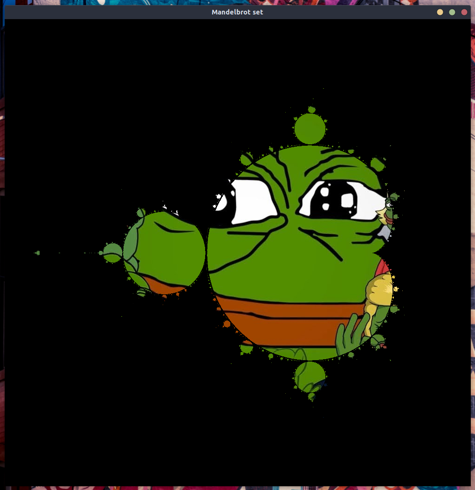

# weekly8
## Introduction
I suggest running the code in `stack repl` 'cause then you needn't constantly change the `main` function and its type signature (looking at you, Easyplot and yo pesky `IO Bool`)

## Problem 1: the same or nay?
It would have been a bit too straight forward, so I decided to extend it to `n-numbers`.
```haskell
trikuMiku :: [Int] -> Bool
trikuMiku ns = maximum ns == minimum ns

-- Here's the exact version, should you fancy 
threeEqs :: Int -> Int -> Int -> Bool
threeEqs a b c = trikuMiku [a,b,c]
```

## Problem 2: gcd
This one can't have been easier, as Haskell's got a `gcd` function in its base lib

```haskell
findTheGcd :: Int -> Int -> Int
findTheGcd = gcd
```

## Problem 3: loaded dice
Just run the `runDice` function with the definition of your dice. For example
```haskell
runDice [1,1,2,3,4,5,6,6,6]
```
plots the results of 100000 throws of the dice where the chances are `2:1:1:1:1:3`.

## Bonus: Mandelbrot set
You can run it either by using `cabal run` or, whilst in `stack repl`, with `:main`

 